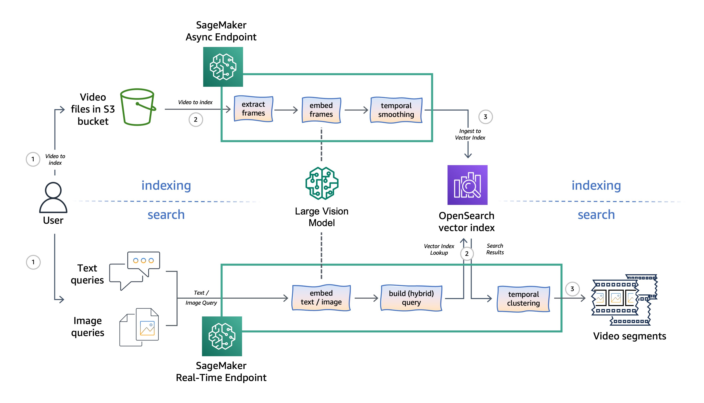

# Implementing semantic video search using Large Vision Models on Amazon SageMaker and OpenSearch Serverless

In the blog post _**Implementing semantic video search using Large Vision Models on Amazon SageMaker and OpenSearch Serverless**_ [TODO: insert blog link once published], we propose to use Large Vision Models (LVMs) for semantic video search using natural language and/or image queries. The code samples in this repo serve as proof-of-concept for the proposed implementation and demonstrate end-to-end functionality of this approach by leveraging both asynchronous and real-time hosting options on Amazon SageMaker to perform video, image, and text processing using open-source LVMs available on Hugging Face Model Hub. We use Amazon OpenSearch Serverless with its vector search collection type for low-latency semantic video search. 

Apart from architectural and infrastructure consideration, the proposed approach to semantic video search also introduces some use-case specific methods, such as Gaussian frame smoothing and clustering, to enhance the video search performance. We also 

## How to start
Open the demo notebook `semantic_video_search_demo.ipynb` for guided demonstration and deployment of the proof-of-concept implementation of the proposed solution.

### Suggested models for demo

The solution is designed to be model agnostic, allowing to, in principle, use any of the available open-source LVMs from Hugging Face Model Hub. However, the solution has been tested with the following models: 

CLIP-based models:

- `'laion/CLIP-ViT-B-32-laion2B-s34B-b79K'` (embedding dimensions: 512) - one of the base OpenCLIP models;

- `'laion/CLIP-ViT-H-14-laion2B-s32B-b79K'` (embedding dimensions: 1024) - one of the best performing OpenCLIP models.

SigLIP-based models:

- `'google/siglip-base-patch16-224'` (embedding dimensions: 768) - one of the base SigLIP models;

- `'google/siglip-so400m-patch14-384'`  (embedding dimensions: 1152) - one of the best multi-lingual SigLIP models.
- 

## Security

See [CONTRIBUTING](CONTRIBUTING.md#security-issue-notifications) for more information.

## License

This project is licensed under the MIT-0 License, except files explicitly marked under different license. See the LICENSE file.